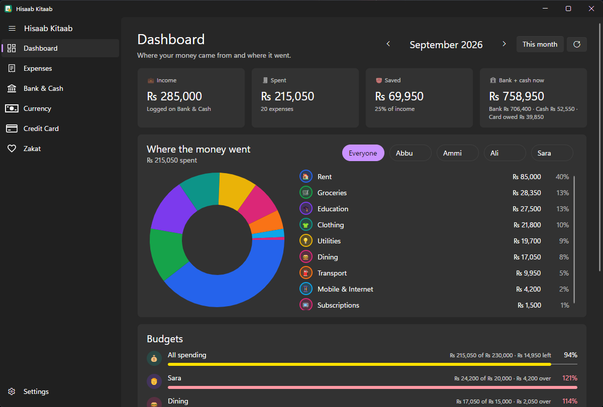
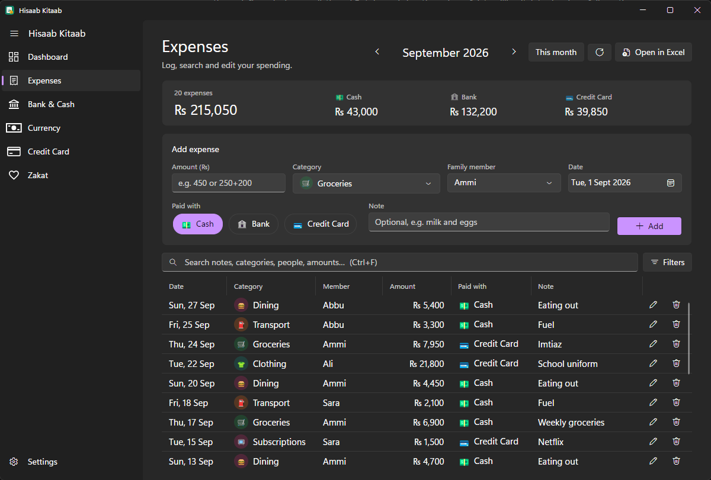
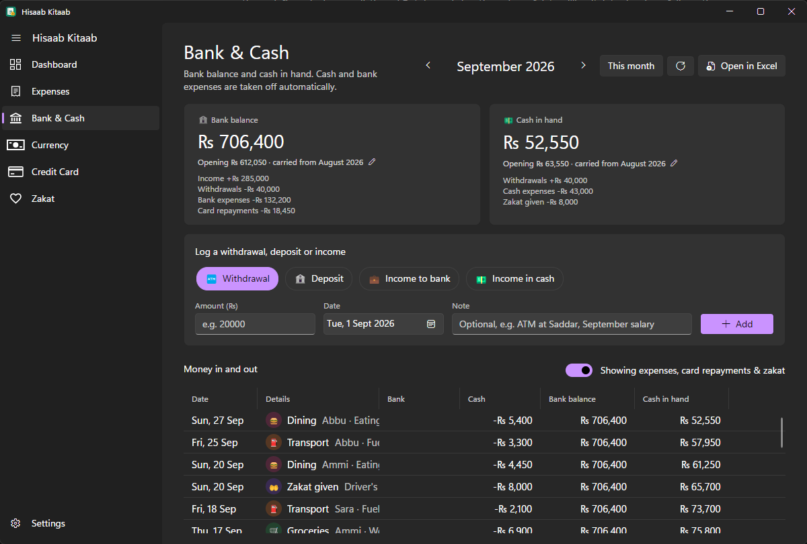
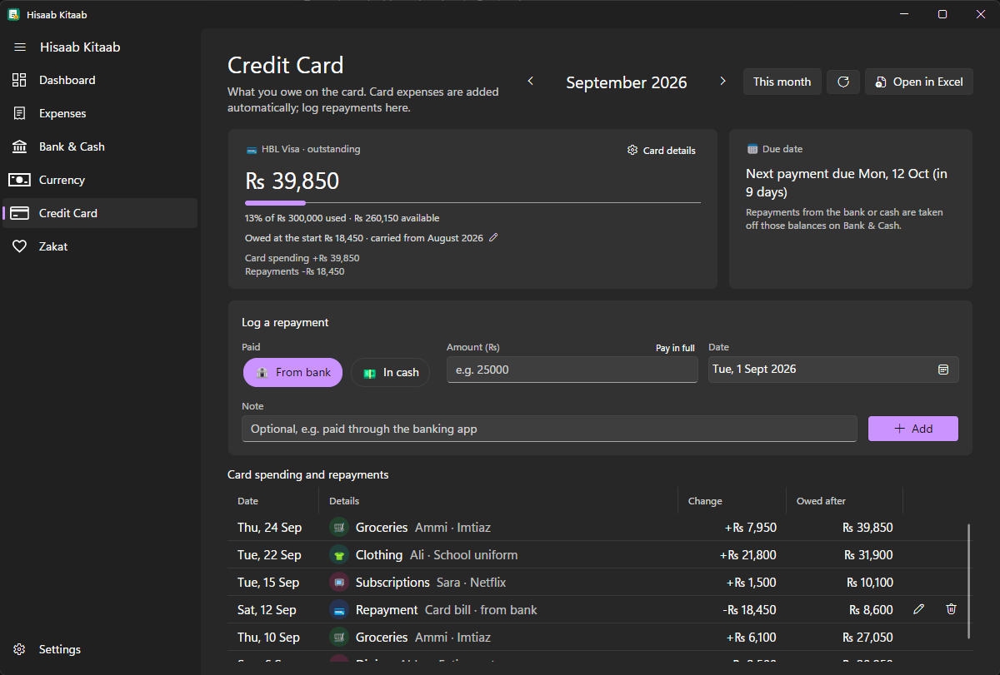
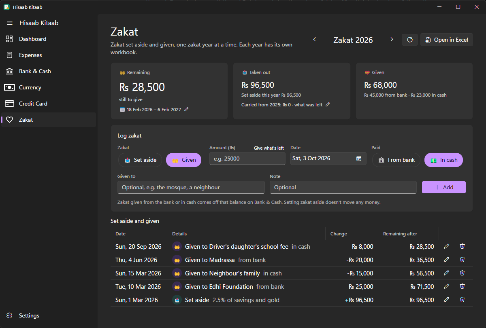
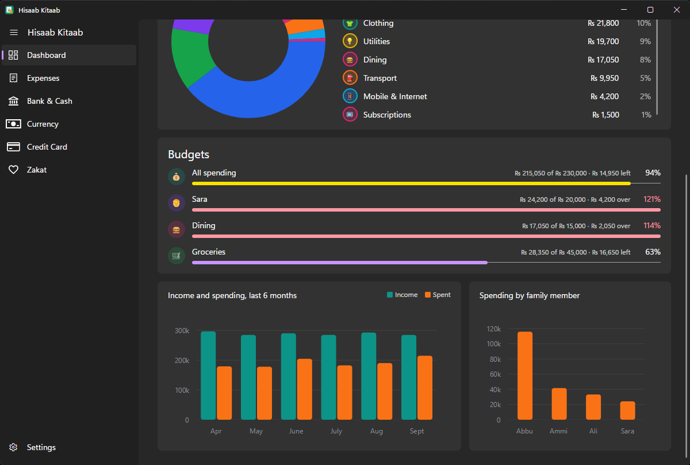
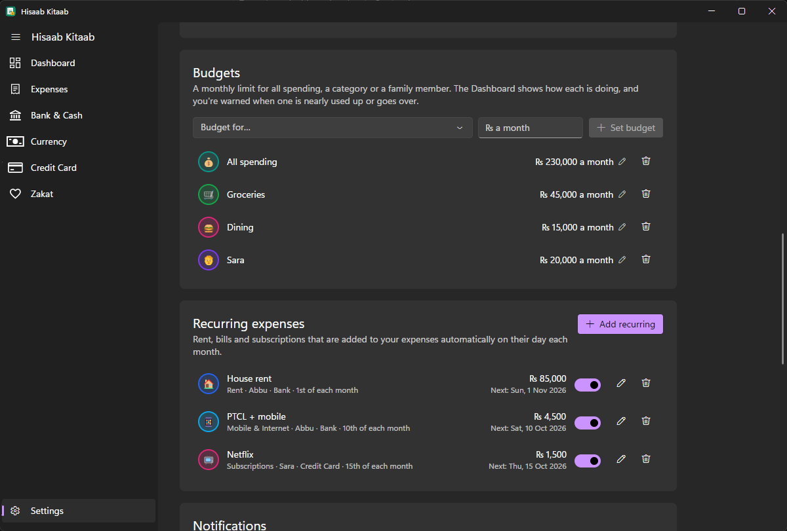

<div align="center">


# Hisaab Kitaab

**A family expense tracker for Windows and Linux that keeps every rupee in plain Excel files on your own computer.**




</div>

*Hisaab kitaab* (حساب کتاب) is Urdu for "keeping accounts". The app tracks a
household's expenses, bank balance, cash in hand, credit card and zakat in
Pakistani rupees (₨). Every month is an ordinary `.xlsx` workbook that you can
open in Excel or LibreOffice whenever you like. There's no account, no cloud
service and no database.

## Features

**Daily use**
- **Quick expense entry.** Type an amount (sums like `250+180` work), press
  Enter, and you're ready for the next one. Category, family member, payment
  method and date stay as you left them.
- **Search and filters.** Search notes, categories, people and amounts, and
  combine filters by date range, member, category, payment method and amount.
- **Family members and categories** with their own emoji and colour, all
  managed in Settings.

**Money, worked out for you**
- **Bank & Cash.** Cash expenses come out of cash in hand, bank expenses out of
  the bank balance. You log only withdrawals, deposits and income; balances
  carry from month to month.
- **Credit card.** Card spending adds to what you owe and repayments come off
  your bank or cash. Shows your limit, how much of it you've used, and when
  the bill is due.
- **Cash count.** Count your notes (₨ 5,000 down to ₨ 10) and coins to check
  that the cash in your wallet matches your records.
- **Zakat.** One file per zakat year, over dates you choose (for example
  Ramadan to Ramadan). Log zakat set aside and given; what's left carries into
  next year, and zakat given comes off your bank or cash.

**Planning**
- **Dashboard.** Income, spending, savings, where the money went (overall or
  per person), a 6-month trend and a per-member comparison.
- **Budgets** for all spending, a category or a person, with warnings when one
  is nearly used up or over.
- **Recurring expenses** (rent, bills, subscriptions) added automatically on
  their day, including months missed while the app was closed.
- **Reminders.** Desktop notifications to log the day's expenses, before the
  card bill is due, and when a budget goes over.

**Your data stays yours**
- **Plain Excel workbooks**, one per month, with live formulas (balances,
  totals, budgets) that stay right even if you edit the file in Excel.
- **Automatic backups** of every file on every save, with one-click restore.
- **Choose where files live**, for example a OneDrive or Google Drive folder
  to keep a copy off your computer.

## Screenshots

| | |
|---|---|
|  **Expenses**: quick entry, search and filters |  **Bank & Cash**: balances worked out from everything you log |
|  **Credit Card**: what's owed, limit used and the due date |  **Zakat**: set aside, given and remaining for your zakat year |
|  **Budgets and trends** |  **Settings**: budgets and recurring expenses |

## Getting started

### Requirements

- [.NET 8 SDK](https://dotnet.microsoft.com/download/dotnet/8.0) to build
  (newer SDKs work too, but you need the .NET 8 runtime to run it).
- **Windows** 10 or 11, or **Linux** with an X11 or XWayland desktop. On Linux,
  Avalonia also needs fontconfig and a few common libraries:

  ```bash
  sudo apt install libfontconfig1 libice6 libsm6     # Debian / Ubuntu
  sudo dnf install fontconfig libICE libSM           # Fedora
  ```

### Run from source

```bash
git clone https://github.com/AWS9760/hisaab-kitaab.git
cd hisaab-kitaab
dotnet run
```

### Build a standalone app

These produce a single self-contained executable, so the computer you run it
on doesn't need .NET installed.

```powershell
# Windows: then run publish\win-x64\HisaabKitaab.exe
dotnet publish -c Release -r win-x64 --self-contained -p:PublishSingleFile=true -o publish/win-x64
```

```bash
# Linux
dotnet publish -c Release -r linux-x64 --self-contained -p:PublishSingleFile=true -o publish/linux-x64
chmod +x publish/linux-x64/HisaabKitaab && ./publish/linux-x64/HisaabKitaab
```

To add it to your Linux application menu, create
`~/.local/share/applications/hisaab-kitaab.desktop`:

```ini
[Desktop Entry]
Type=Application
Name=Hisaab Kitaab
Comment=Family expense tracker
Exec=/path/to/publish/linux-x64/HisaabKitaab
Icon=/path/to/hisaab-kitaab/Assets/hisaab-kitaab.png
Categories=Office;Finance;
```

### Try it without touching your real data

Set `HISAAB_KITAAB_HOME` to any folder and the app keeps its settings and
workbooks there instead:

```powershell
$env:HISAAB_KITAAB_HOME = "D:\HisaabTest"; dotnet run
```

```bash
HISAAB_KITAAB_HOME=~/hisaab-test dotnet run
```

## Where your data is kept

| What | Default location (Windows) | Default location (Linux) |
|---|---|---|
| Monthly workbooks | `Documents\Hisaab Kitaab\2026\Sept_2026.xlsx` | `~/Documents/Hisaab Kitaab/2026/Sept_2026.xlsx` |
| Zakat workbooks | `Documents\Hisaab Kitaab\2026\Zakat_2026.xlsx` | `~/Documents/Hisaab Kitaab/2026/Zakat_2026.xlsx` |
| Backups | `Documents\Hisaab Kitaab\Backups\` | `~/Documents/Hisaab Kitaab/Backups/` |
| Settings | `%APPDATA%\HisaabKitaab\settings.json` | `~/.config/HisaabKitaab/settings.json` |

You can move any of these from **Settings**. Each monthly workbook has five
sheets: **Expenses**, **Summary**, **Bank & Cash**, **Currency Denominations**
and **Credit Card**. You can edit them in Excel: rows are matched by a hidden
ID column, columns are found by their headers, and rows the app can't read are
reported rather than changed or deleted.

The **[user guide](docs/USER_GUIDE.md)** explains every screen and the
workbook layout in detail.

## Built with

- [C# / .NET 8](https://dotnet.microsoft.com/)
- [Avalonia UI](https://avaloniaui.net/) with
  [FluentAvalonia](https://github.com/amwx/FluentAvalonia) (light and dark themes)
- [ClosedXML](https://github.com/ClosedXML/ClosedXML) for reading and writing Excel files
- [LiveCharts2](https://livecharts.dev/) for the charts
- [CommunityToolkit.Mvvm](https://learn.microsoft.com/dotnet/communitytoolkit/mvvm/) for the MVVM plumbing

## Project structure

```
Assets/       App icon (.ico for Windows, .png for Linux)
Models/       Plain data types: expenses, entries, budgets, zakat, settings
Services/     Balances, budgets, recurring expenses, reminders, backups, settings
  Excel/      One class per worksheet; the only code that touches ClosedXML
Styles/       Shared styles (cards, DataGrid fixes, icons)
ViewModels/   One view model per screen (CommunityToolkit.Mvvm)
Views/        Avalonia XAML views, one per screen (Settings/ holds its sections)
docs/         User guide and screenshots
```

Balances are never stored as data: the app works them out from your expenses
and entries every time, and the workbooks hold Excel formulas that do the same
sums, so both always agree.

## License

This project is licensed under the MIT License.

---

## Author

**Abdul Wali**

Computer Science Student | Software Developer

---

⭐ *If you find this project useful, consider giving it a star!*